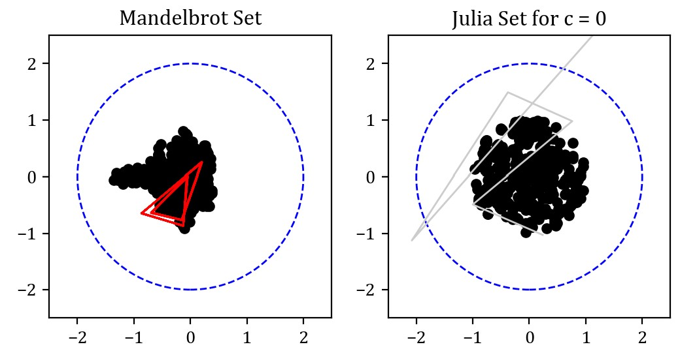
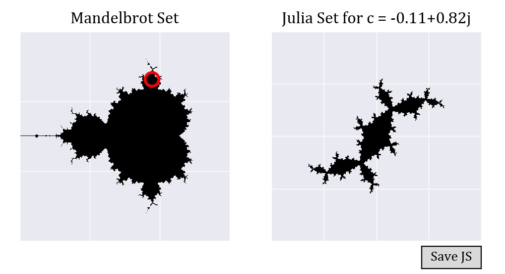
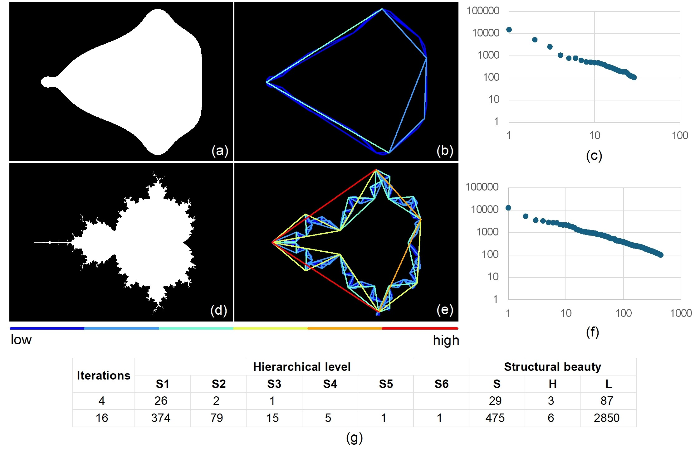

# beauty-of-fractals

This is a Python3 program to understand and evaluate the structural beauty of the Mandelbrots set and Julia sets.

## Requirements

This implementations is mainly based on matplotlib and geopandas. You can install all the required environment through:

``` bash
pip install -r requirements.txt
```

Addtionally, ArcGIS desktop 10.4 (and Axwoman 6.3 if possible <http://livablecitylab.hkust-gz.edu.cn/binjiang/axwoman/>) is required for visualizing the inherent hierarchy of these fractals.

## Painting the Mandelbrots set and the Julia sets

1. Open Python script `s3_trajectory.py` and set the value `c_pre` in line 6 for the complex number c to draw different Julia sets . The trajectory of sequence {zn} for the Mandelbrot set will be displayed on the left side while the Julia set on the right side.

2. Run the Python script in your IDE or run command:

    ``` bash
    python s3_trajectory.py
    ```

3. Click and drag a point from any location to another space within the left complex plane. If the current point belongs to the Mandelbrot set—in other words, if the corresponding sequence remains bounded within the threshold circle—it will be marked as a black point on the visualization. Here is an illustration of the user interface:


## Generating binary images

1. Open Python script `s3_binary.py` and adjust different sizes of the images where you can see MS and JS at different resolutions. The related parameters are from line 12 to lin 16.

2. Run the Python script in your IDE or run command:

    ``` bash
    python s3_binary.py
    ```

3. Click and drag a point (in red) from any location to another space within the complex plane of MS. Each point corresponds to a different JS. Click `save` button to save the current image of JS such as 1-0.10_0.79.png1 under the root folder. The current images of the Mandelbrot set will be saved automatically as `ms_%max_iter%.png`.


## Identifying substructures

1. Open s4_bends.py and change the parameters of input_path and output_path where there are the input Mandelbrot set polygon shapefile and output contour line shapefile of the identified bends. We have already provided a sample contour in `sample_data/contour16.shp`.

2. Run the Python script in your IDE or run command:

    ``` bash
    python s4_bends.py
    ```

3. The substructures, which are the bends defined by three vertices, will be autormatically indentified and saved as `bends.shp`. Please follow the `Tutorial4MSJS.docx` for more details on calculating the degree of substral beauty.

## Results

* Comparison between the Mandelbrot set after 4 iterations and 16 iterations

